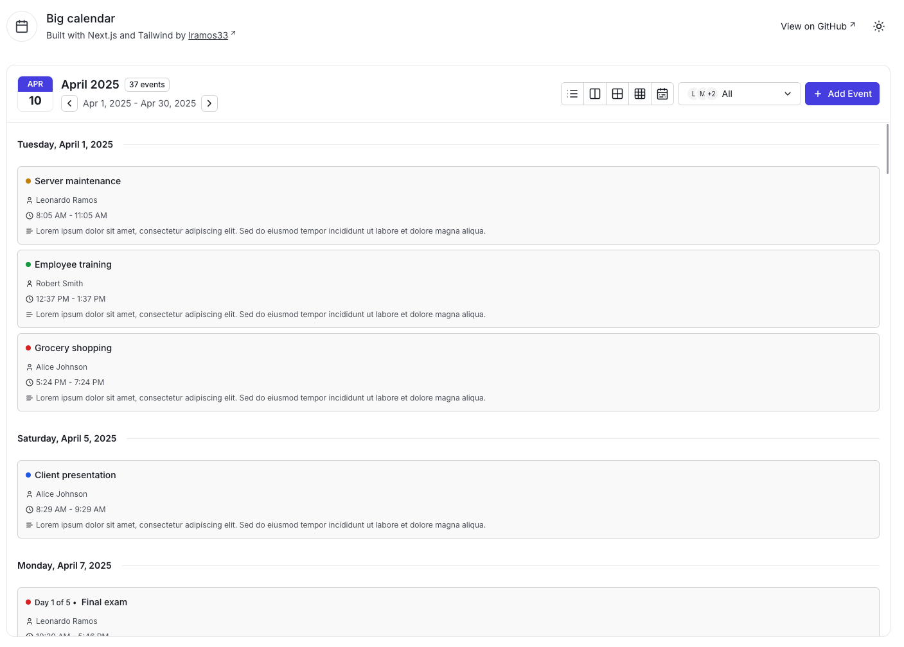

# Modern Calendar Application

A feature-rich calendar application built with Next.js, TypeScript, and Tailwind CSS. This project provides a modern, responsive interface for managing events and schedules with multiple viewing options.

## Preview




## Features

- 📅 Multiple calendar views:

  - Agenda view
  - Year view
  - Month view
  - Week view with detailed time slots
  - Day view with hourly breakdown

- 🎨 Event customization:

  - Multiple color options for events
  - Two badge display variants (dot and colored)
  - Support for single and multi-day events

- 👥 User management:

  - Filter events by user
  - View all users's events simultaneously
  - User avatars and profile integration

- ⚡ Real-time features:

  - Live time indicator
  - Current event highlighting
  - Dynamic event positioning

- 🎯 UI/UX features:
  - Responsive design for all screen sizes
  - Intuitive navigation between dates
  - Clean and modern interface
  - Dark mode support

## Tech Stack

- **Framework**: Next.js 14
- **Language**: TypeScript
- **Styling**: Tailwind v3
- **Date Management**: date-fns
- **UI Components**: shadcn/ui
- **State Management**: React Context

## Getting Started

1. Clone the repository:

```bash
git clone https://github.com/yourusername/calendar-app.git
cd calendar-app
```

2. Install dependencies:

```bash
npm install
```

3. Start the development server:

```bash
npm run dev
```

or

```bash
npm run turbo
```

4. Open your browser and navigate to `http://localhost:3000` to view the application.

## Project Structure

The project structure is organized as follows:

```
src/
├── app/
├── calendar/                     # All files related to calendar are in this folder
│   ├── components/
│   │   ├── dialogs/              # Dialogs components
│   │   ├── agenda-view/          # Agenda view components
│   │   ├── header/               # Calendar header components
│   │   ├── month-view/           # Month view components
│   │   ├── week-and-day-view/    # Week and day view components
│   │   └── year-view/            # Year view components
│   ├── contexts/                 # Calendar context and state management
│   ├── helpers/                  # Utility functions
│   ├── interfaces/               # TypeScript interfaces
│   └── types/                    # TypeScript types
└── components/                   # Components not related to calendar eg: ui and layout components
```

## Contributing

Contributions are welcome! Please feel free to submit a Pull Request.

##

<p align="center">
  Made by Leonardo Ramos 👋 <a href="https://www.linkedin.com/in/lramos33/">Get in touch!</a>
<p>
